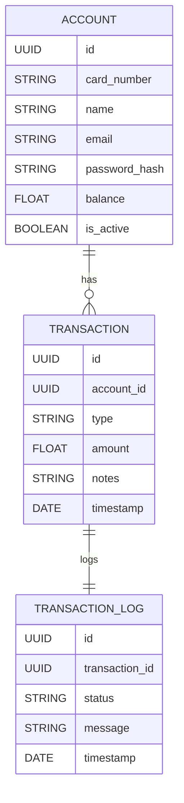

# Bank-API

## Use Case

## Entity-Relationship Diagram (ERD)

```mermaid
erDiagram
    ACCOUNT {
        UUID id
        STRING card_number
        STRING name
        STRING email
        STRING password_hash
        FLOAT balance
        BOOLEAN is_active
    }
    
    TRANSACTION {
        UUID id
        UUID account_id
        STRING type
        FLOAT amount
        STRING notes
        DATE timestamp
    }
    
    TRANSACTION_LOG {
        UUID id
        UUID transaction_id
        STRING status
        STRING message
        DATE timestamp
    }
    
    ACCOUNT ||--o{ TRANSACTION : has
    TRANSACTION ||--|| TRANSACTION_LOG : logs
```
## Class Diagram

