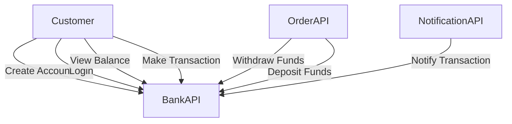
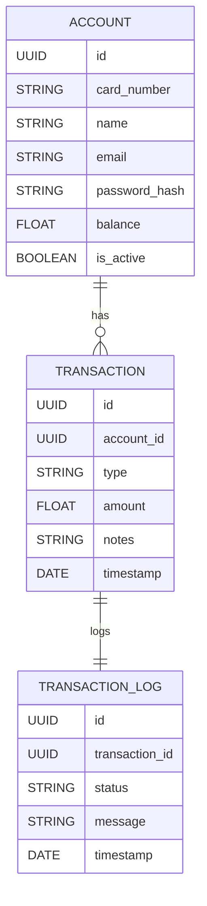
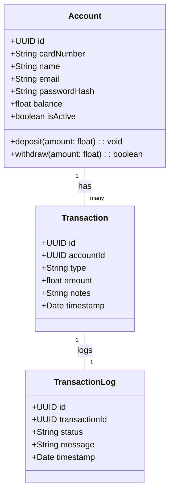

# Bank-API

## Use Case

```mermaid
graph TD
  Customer -- Create Account --> BankAPI
  Customer -- Login --> BankAPI
  Customer -- View Balance --> BankAPI
  Customer -- Make Transaction --> BankAPI
  OrderAPI -- Withdraw Funds --> BankAPI
  OrderAPI -- Deposit Funds --> BankAPI
  NotificationAPI -- Notify Transaction --> BankAPI
```

## Entity-Relationship Diagram (ERD)

```mermaid
erDiagram
    ACCOUNT {
        UUID id
        STRING card_number
        STRING name
        STRING email
        STRING password_hash
        FLOAT balance
        BOOLEAN is_active
    }
    
    TRANSACTION {
        UUID id
        UUID account_id
        STRING type
        FLOAT amount
        STRING notes
        DATE timestamp
    }
    
    TRANSACTION_LOG {
        UUID id
        UUID transaction_id
        STRING status
        STRING message
        DATE timestamp
    }
    
    ACCOUNT ||--o{ TRANSACTION : has
    TRANSACTION ||--|| TRANSACTION_LOG : logs
```
## Class Diagram

```mermaid
classDiagram
    class Account {
        +UUID id
        +String cardNumber
        +String name
        +String email
        +String passwordHash
        +float balance
        +boolean isActive
        +deposit(amount: float): void
        +withdraw(amount: float): boolean
    }
    
    class Transaction {
        +UUID id
        +UUID accountId
        +String type
        +float amount
        +String notes
        +Date timestamp
    }

    class TransactionLog {
        +UUID id
        +UUID transactionId
        +String status
        +String message
        +Date timestamp
    }

    Account "1" -- "many" Transaction : has
    Transaction "1" -- "1" TransactionLog : logs
```

